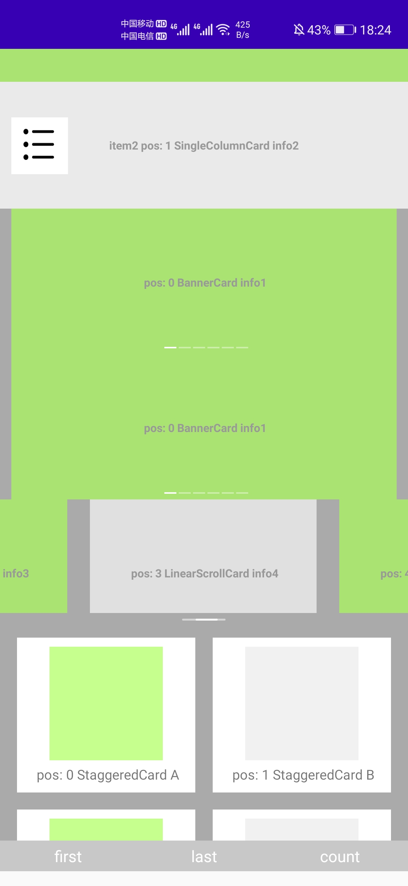
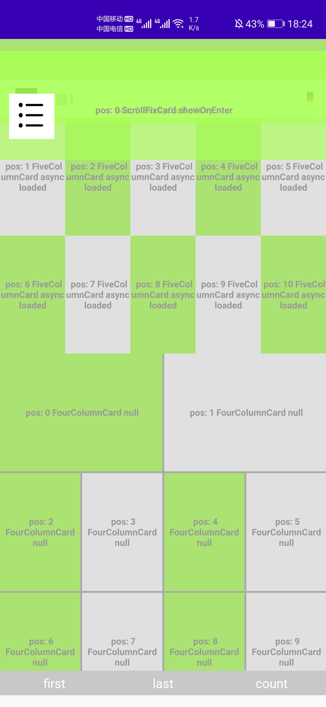

# TVLauncherComponent

## 基于Tangram的组件化Android-TV信息流

#### 基本概念

+ 卡片：同一区块的组件集合，负责对组件进行布局。
+ 组件：最小业务单元，好比 RecyclelrView 的 Item。

#### 默认卡片

* 通用流式布局卡片（网格）
* 线性布局卡片
* 固定位置布局卡片
* 滑动固定布局卡片
* 滑动吸顶/吸底布局卡片
* 一拖N布局卡片
* 轮播布局卡片
* 瀑布流布局卡片

 

